# System Architecture Analysis

## Overview

- **Project**: /home/tom/github/wronai/nfo
- **Primary Language**: python
- **Languages**: python: 54, shell: 2, go: 1, rust: 1
- **Analysis Mode**: static
- **Total Functions**: 294
- **Total Classes**: 38
- **Modules**: 58
- **Entry Points**: 216

## Architecture by Module

### nfo.log_flow
- **Functions**: 20
- **Classes**: 1
- **File**: `log_flow.py`

### nfo.pipeline_sink
- **Functions**: 16
- **Classes**: 1
- **File**: `pipeline_sink.py`

### nfo.sinks
- **Functions**: 15
- **Classes**: 4
- **File**: `sinks.py`

### nfo.env
- **Functions**: 14
- **Classes**: 3
- **File**: `env.py`

### demo.app
- **Functions**: 13
- **Classes**: 1
- **File**: `app.py`

### nfo.configure
- **Functions**: 11
- **Classes**: 1
- **File**: `configure.py`

### nfo.extractors
- **Functions**: 10
- **File**: `extractors.py`

### examples.grpc-service.nfo_pb2_grpc
- **Functions**: 10
- **Classes**: 3
- **File**: `nfo_pb2_grpc.py`

### nfo
- **Functions**: 9
- **File**: `__init__.py`

### nfo.__main__
- **Functions**: 9
- **File**: `__main__.py`

### nfo.llm
- **Functions**: 8
- **Classes**: 1
- **File**: `llm.py`

### nfo.terminal
- **Functions**: 8
- **Classes**: 1
- **File**: `terminal.py`

### nfo.models
- **Functions**: 8
- **Classes**: 1
- **File**: `models.py`

### nfo.logger
- **Functions**: 7
- **Classes**: 1
- **File**: `logger.py`

### nfo.buffered_sink
- **Functions**: 6
- **Classes**: 1
- **File**: `buffered_sink.py`

### examples.grpc-service.server
- **Functions**: 6
- **Classes**: 1
- **File**: `server.py`

### nfo.webhook
- **Functions**: 5
- **Classes**: 1
- **File**: `webhook.py`

### nfo.redact
- **Functions**: 5
- **File**: `redact.py`

### nfo.prometheus
- **Functions**: 5
- **Classes**: 1
- **File**: `prometheus.py`

### nfo.logged
- **Functions**: 5
- **File**: `logged.py`

## Key Entry Points

Main execution flows into the system:

### nfo.meta_decorators.meta_log
> Decorator that logs metadata instead of raw binary data.

Unlike ``@log_call``, this decorator:

- Automatically detects binary payloads and extracts 
- **Calls**: inspect.signature, list, inspect.iscoroutinefunction, functools.wraps, decorator, sig.parameters.keys, functools.wraps, time.perf_counter

### nfo.log_flow.LogFlowParser.compress_for_llm
> Compress graph data into an LLM-friendly textual summary.
- **Calls**: graph.get, list, list, list, lines.extend, lines.extend, None.join, isinstance

### nfo.decorators._decision.decision_log
> Decorator that logs decision outcomes with structured reasons.

The decorated function **must** return a dict (or object with ``decision``
and ``reaso
- **Calls**: inspect.iscoroutinefunction, functools.wraps, decorator, functools.wraps, time.perf_counter, time.perf_counter, nfo.decorators._core._get_default_logger, fn

### examples.grpc-service.client.run_demo
> Run all four gRPC RPCs against nfo server.
- **Calls**: print, print, grpc.insecure_channel, nfo_pb2_grpc.NfoLoggerStub, print, stub.LogCall, print, print

### examples.grpc-service.server.NfoLoggerServicer.QueryLogs
> Query stored logs from SQLite.
- **Calls**: sqlite3.connect, params.append, None.fetchall, conn.close, nfo_pb2.QueryResponse, params.append, params.append, params.append

### nfo.log_flow.LogFlowParser.build_flow_graph
> Build a node/edge graph from grouped trace logs.
- **Calls**: isinstance, grouped.items, nodes.values, edges.values, node_rows.sort, edge_rows.sort, traces.sort, entries_or_grouped.items

### nfo.__main__.main
- **Calls**: argparse.ArgumentParser, parser.add_subparsers, subparsers.add_parser, run_parser.add_argument, run_parser.add_argument, run_parser.add_argument, run_parser.add_argument, subparsers.add_parser

### nfo.log_flow.LogFlowParser.normalize_entry
> Normalize supported log entry formats into a single event schema.
- **Calls**: isinstance, raw.get, str, str, str, None.upper, nfo.log_flow._extract_trace_id, str

### nfo.click.NfoCommand.invoke
- **Calls**: ctx.ensure_object, obj.get, time.perf_counter, ctx.params.get, ctx.params.get, ctx.params.get, TerminalSink, Logger

### examples.async-usage.main.main
- **Calls**: examples.async-usage.main.setup_logger, print, print, print, print, print, print, print

### nfo.pipeline_sink.PipelineSink._render_block
> Render a full pipeline tick block.
- **Calls**: io.StringIO, out.write, out.write, out.write, self._render_data_flow, out.write, self._render_footer, out.write

### examples.env-tagger.main.demo_env_tagger
> EnvTagger wraps a sink to auto-tag every log entry.
- **Calls**: print, EnvTagger, Logger, nfo.decorators._core.set_default_logger, demo.app.UserService.create_user, logger.close, sqlite3.connect, None.fetchone

### nfo.click.NfoGroup.invoke
- **Calls**: self._resolve_logger, time.perf_counter, None.invoke, LogEntry, logger.emit, LogEntry, logger.emit, super

### nfo.terminal.TerminalSink._write_toon
> Compact TOON format — minimal, machine+human readable.

Example:
    09:30:23 DEBUG add(3,7)->10 [0.0ms]
    09:30:23 ERROR risky(0) !ZeroDivisionErro
- **Calls**: entry.timestamp.strftime, self._stream.write, entry.kwargs.items, None.join, entry.extra.get, entry.extra.get, args_parts.append, args_parts.append

### nfo.pipeline_sink.PipelineSink._render_sub_lines
> Render sub-lines for decisions and annotations.
- **Calls**: extra.get, extra.get, extra.get, extra.get, extra.get, extra.get, extra.get, extra.get

### nfo.fastapi_middleware.FastAPIMiddleware.__call__
- **Calls**: scope.get, scope.get, None.decode, scope.get, time.time, self._emit, self.app, scope.get

### nfo.terminal.TerminalSink._write_markdown
> Markdown format — rendered via rich or written as plain text.
- **Calls**: entry.extra.get, lines.append, None.join, lines.append, lines.append, lines.append, lines.append, lines.append

### nfo.sinks.MarkdownSink.write
- **Calls**: entry.as_dict, d.get, d.get, d.get, d.get, lines.append, lines.append, lines.append

### examples.env-tagger.main.demo_dynamic_router
> DynamicRouter sends logs to different sinks based on rules.
- **Calls**: print, DynamicRouter, Logger, nfo.decorators._core.set_default_logger, nfo.decorators._catch.catch, examples.click-integration.demo_basic.process, risky, logger.close

### examples.bash-wrapper.main.main
- **Calls**: examples.bash-wrapper.main.setup_logger, examples.bash-wrapper.main.run_bash, print, logger.close, sys.exit, len, print, print

### examples.grpc-service.server.serve
> Start the gRPC server.
- **Calls**: grpc.server, nfo_pb2_grpc.add_NfoLoggerServicer_to_server, server.add_insecure_port, server.start, print, print, print, print

### demo.load_generator.main
- **Calls**: argparse.ArgumentParser, parser.add_argument, parser.add_argument, parser.add_argument, parser.parse_args, print, print, demo.load_generator.weighted_choice

### nfo.pipeline_sink.PipelineSink._render_footer
> Render the summary footer line.
- **Calls**: len, sum, parts.append, None.join, self._visible_len, max, completion.extra.get, completion.extra.get

### demo.app.demo_batch
> Run a batch of mixed calls (success + errors) for load simulation.
- **Calls**: app.get, range, range, range, range, demo.app.compute_fibonacci, demo.app.process_order, demo.app.risky_division

### nfo.terminal.TerminalSink._write_color
> ANSI colored format — replaces typical CLI logs.
- **Calls**: self.LEVEL_COLORS.get, self._stream.write, parts.append, parts.append, parts.append, entry.timestamp.strftime, entry.args_repr, parts.append

### nfo.pipeline_sink.PipelineSink._render_data_flow
> Render a data flow summary showing sizes at key steps.
- **Calls**: self._visible_len, ex.get, ex.get, ex.get, ex.get, ex.get, self._c, parts.append

### nfo.terminal.TerminalSink._write_table
> Tabular format via rich.table (fallback to ascii).
- **Calls**: Table, table.add_column, table.add_column, table.add_column, table.add_column, entry.timestamp.strftime, None.get, table.add_row

### examples.click-integration.demo_formats.demo
- **Calls**: examples.click-integration.demo_formats.make_entry, examples.click-integration.demo_formats.make_entry, print, print, print, TerminalSink, TerminalSink, print

### examples.http-service.main.get_logs
> Query stored logs from SQLite.
- **Calls**: app.get, Query, Query, Query, sqlite3.connect, params.append, None.fetchall, conn.close

### examples.env-tagger.main.demo_diff_tracker
> DiffTracker detects when function output changes.
- **Calls**: print, DiffTracker, Logger, nfo.decorators._core.set_default_logger, examples.markdown-sink.main.compute, examples.markdown-sink.main.compute, logger.close, print

## Process Flows

Key execution flows identified:

### Flow 1: meta_log
```
meta_log [nfo.meta_decorators]
```

### Flow 2: compress_for_llm
```
compress_for_llm [nfo.log_flow.LogFlowParser]
```

### Flow 3: decision_log
```
decision_log [nfo.decorators._decision]
```

### Flow 4: run_demo
```
run_demo [examples.grpc-service.client]
```

### Flow 5: QueryLogs
```
QueryLogs [examples.grpc-service.server.NfoLoggerServicer]
```

### Flow 6: build_flow_graph
```
build_flow_graph [nfo.log_flow.LogFlowParser]
```

### Flow 7: main
```
main [nfo.__main__]
```

### Flow 8: normalize_entry
```
normalize_entry [nfo.log_flow.LogFlowParser]
```

### Flow 9: invoke
```
invoke [nfo.click.NfoCommand]
```

### Flow 10: _render_block
```
_render_block [nfo.pipeline_sink.PipelineSink]
```

## Key Classes

### nfo.pipeline_sink.PipelineSink
> Sink that groups log entries by ``pipeline_run_id`` and renders pipeline ticks.

Parameters:
    del
- **Methods**: 19
- **Key Methods**: nfo.pipeline_sink.PipelineSink.__init__, nfo.pipeline_sink.PipelineSink.tick_count, nfo.pipeline_sink.PipelineSink.pending_runs, nfo.pipeline_sink.PipelineSink.session_cost, nfo.pipeline_sink.PipelineSink.write, nfo.pipeline_sink.PipelineSink.close, nfo.pipeline_sink.PipelineSink._flush_stale, nfo.pipeline_sink.PipelineSink._flush_run, nfo.pipeline_sink.PipelineSink._c, nfo.pipeline_sink.PipelineSink._render_block
- **Inherits**: Sink

### nfo.log_flow.LogFlowParser
> Parse logs, group by trace_id, and build compressed flow graphs.
- **Methods**: 13
- **Key Methods**: nfo.log_flow.LogFlowParser.__init__, nfo.log_flow.LogFlowParser.normalize_entry, nfo.log_flow.LogFlowParser.parse_jsonl, nfo.log_flow.LogFlowParser.from_jsonl, nfo.log_flow.LogFlowParser.parse_logs, nfo.log_flow.LogFlowParser.parse, nfo.log_flow.LogFlowParser.group_by_trace_id, nfo.log_flow.LogFlowParser.build_flow_graph, nfo.log_flow.LogFlowParser.to_graph, nfo.log_flow.LogFlowParser.parse_to_graph

### nfo.terminal.TerminalSink
> Sink that displays log entries in the terminal with configurable format.
- **Methods**: 9
- **Key Methods**: nfo.terminal.TerminalSink.__init__, nfo.terminal.TerminalSink.format, nfo.terminal.TerminalSink.write, nfo.terminal.TerminalSink._write_ascii, nfo.terminal.TerminalSink._write_color, nfo.terminal.TerminalSink._write_markdown, nfo.terminal.TerminalSink._write_toon, nfo.terminal.TerminalSink._write_table, nfo.terminal.TerminalSink.close
- **Inherits**: Sink

### nfo.buffered_sink.AsyncBufferedSink
> Buffer log entries and write them batch-wise in a background thread.

Args:
    delegate: The downst
- **Methods**: 7
- **Key Methods**: nfo.buffered_sink.AsyncBufferedSink.__init__, nfo.buffered_sink.AsyncBufferedSink.write, nfo.buffered_sink.AsyncBufferedSink.flush, nfo.buffered_sink.AsyncBufferedSink.close, nfo.buffered_sink.AsyncBufferedSink.pending, nfo.buffered_sink.AsyncBufferedSink._flush_loop, nfo.buffered_sink.AsyncBufferedSink._do_flush
- **Inherits**: Sink

### nfo.logger.Logger
> Central logger instance.

Collects :class:`LogEntry` objects from decorators and dispatches them
to 
- **Methods**: 7
- **Key Methods**: nfo.logger.Logger.__init__, nfo.logger.Logger.add_sink, nfo.logger.Logger.remove_sink, nfo.logger.Logger.emit, nfo.logger.Logger._format_stdlib, nfo.logger.Logger._redact_entry, nfo.logger.Logger.close

### nfo.llm.LLMSink
> Sink that sends ERROR-level log entries to an LLM for root-cause analysis.

The LLM response is stor
- **Methods**: 6
- **Key Methods**: nfo.llm.LLMSink.__init__, nfo.llm.LLMSink._build_user_prompt, nfo.llm.LLMSink._analyze, nfo.llm.LLMSink._process, nfo.llm.LLMSink.write, nfo.llm.LLMSink.close
- **Inherits**: Sink

### nfo.ring_buffer_sink.RingBufferSink
> In-memory ring buffer that flushes context to *delegate* on error.

Args:
    delegate: Downstream s
- **Methods**: 6
- **Key Methods**: nfo.ring_buffer_sink.RingBufferSink.__init__, nfo.ring_buffer_sink.RingBufferSink.write, nfo.ring_buffer_sink.RingBufferSink.close, nfo.ring_buffer_sink.RingBufferSink.buffered, nfo.ring_buffer_sink.RingBufferSink.flush_count, nfo.ring_buffer_sink.RingBufferSink.capacity
- **Inherits**: Sink

### nfo.models.LogEntry
> A single log entry produced by a decorated function call.
- **Methods**: 6
- **Key Methods**: nfo.models.LogEntry.now, nfo.models.LogEntry.args_repr, nfo.models.LogEntry.kwargs_repr, nfo.models.LogEntry.return_value_repr, nfo.models.LogEntry.as_dict, nfo.models.LogEntry.as_compact

### nfo.webhook.WebhookSink
> Sink that POSTs log entries to an HTTP webhook endpoint.

Designed for Slack, Discord, Microsoft Tea
- **Methods**: 5
- **Key Methods**: nfo.webhook.WebhookSink.__init__, nfo.webhook.WebhookSink._build_payload, nfo.webhook.WebhookSink._send, nfo.webhook.WebhookSink.write, nfo.webhook.WebhookSink.close
- **Inherits**: Sink

### nfo.prometheus.PrometheusSink
> Sink that exports nfo log entries as Prometheus metrics.

Metrics exposed:
- ``nfo_calls_total`` — c
- **Methods**: 5
- **Key Methods**: nfo.prometheus.PrometheusSink.__init__, nfo.prometheus.PrometheusSink._start_server, nfo.prometheus.PrometheusSink.write, nfo.prometheus.PrometheusSink.close, nfo.prometheus.PrometheusSink.get_metrics
- **Inherits**: Sink

### nfo.sinks.SQLiteSink
> Persist log entries to a SQLite database.
- **Methods**: 5
- **Key Methods**: nfo.sinks.SQLiteSink.__init__, nfo.sinks.SQLiteSink._get_conn, nfo.sinks.SQLiteSink._ensure_table, nfo.sinks.SQLiteSink.write, nfo.sinks.SQLiteSink.close
- **Inherits**: Sink

### nfo.binary_router.BinaryAwareRouter
> Route log entries to different sinks based on payload characteristics.

Args:
    lightweight_sink: 
- **Methods**: 4
- **Key Methods**: nfo.binary_router.BinaryAwareRouter.__init__, nfo.binary_router.BinaryAwareRouter.write, nfo.binary_router.BinaryAwareRouter._has_large_data, nfo.binary_router.BinaryAwareRouter.close
- **Inherits**: Sink

### nfo.env.DiffTracker
> Tracks input/output changes between function calls across versions.

Solves the "Structured diff log
- **Methods**: 4
- **Key Methods**: nfo.env.DiffTracker.__init__, nfo.env.DiffTracker._make_key, nfo.env.DiffTracker.write, nfo.env.DiffTracker.close
- **Inherits**: Sink

### nfo.sinks.CSVSink
> Append log entries to a CSV file.
- **Methods**: 4
- **Key Methods**: nfo.sinks.CSVSink.__init__, nfo.sinks.CSVSink._write_header_if_needed, nfo.sinks.CSVSink.write, nfo.sinks.CSVSink.close
- **Inherits**: Sink

### nfo.sinks.MarkdownSink
> Append log entries to a Markdown file as structured sections.
- **Methods**: 4
- **Key Methods**: nfo.sinks.MarkdownSink.__init__, nfo.sinks.MarkdownSink._write_header_if_needed, nfo.sinks.MarkdownSink.write, nfo.sinks.MarkdownSink.close
- **Inherits**: Sink

### examples.grpc-service.server.NfoLoggerServicer
> Implementation of NfoLogger gRPC service.
- **Methods**: 4
- **Key Methods**: examples.grpc-service.server.NfoLoggerServicer.LogCall, examples.grpc-service.server.NfoLoggerServicer.BatchLog, examples.grpc-service.server.NfoLoggerServicer.StreamLog, examples.grpc-service.server.NfoLoggerServicer.QueryLogs
- **Inherits**: nfo_pb2_grpc.NfoLoggerServicer

### examples.grpc-service.nfo_pb2_grpc.NfoLoggerServicer
> --- Service ---

    
- **Methods**: 4
- **Key Methods**: examples.grpc-service.nfo_pb2_grpc.NfoLoggerServicer.LogCall, examples.grpc-service.nfo_pb2_grpc.NfoLoggerServicer.BatchLog, examples.grpc-service.nfo_pb2_grpc.NfoLoggerServicer.StreamLog, examples.grpc-service.nfo_pb2_grpc.NfoLoggerServicer.QueryLogs
- **Inherits**: object

### examples.grpc-service.nfo_pb2_grpc.NfoLogger
> --- Service ---

    
- **Methods**: 4
- **Key Methods**: examples.grpc-service.nfo_pb2_grpc.NfoLogger.LogCall, examples.grpc-service.nfo_pb2_grpc.NfoLogger.BatchLog, examples.grpc-service.nfo_pb2_grpc.NfoLogger.StreamLog, examples.grpc-service.nfo_pb2_grpc.NfoLogger.QueryLogs
- **Inherits**: object

### nfo.fastapi_middleware.FastAPIMiddleware
> ASGI middleware that emits one nfo LogEntry per HTTP request.

Each entry has:
  - ``function_name``
- **Methods**: 3
- **Key Methods**: nfo.fastapi_middleware.FastAPIMiddleware.__init__, nfo.fastapi_middleware.FastAPIMiddleware.__call__, nfo.fastapi_middleware.FastAPIMiddleware._emit

### nfo.env.EnvTagger
> Sink wrapper that auto-tags every log entry with:
- environment (dev/staging/prod/k8s/docker/ci)
- t
- **Methods**: 3
- **Key Methods**: nfo.env.EnvTagger.__init__, nfo.env.EnvTagger.write, nfo.env.EnvTagger.close
- **Inherits**: Sink

## Data Transformation Functions

Key functions that process and transform data:

### nfo.llm.LLMSink._process
> Analyze entry and enrich it.
- **Output to**: nfo.llm.scan_entry_for_injection, self._analyze, self.delegate.write, entry.level.upper, self.on_analysis

### nfo.extractors.detect_format
> Detect file format from magic bytes.
- **Output to**: len

### demo.app.process_order
> Simulate order processing.
- **Output to**: nfo.decorators._log_call.log_call, time.sleep, random.uniform

### nfo.log_flow.LogFlowParser.parse_jsonl
> Parse JSON Lines into normalized events.

Args:
    source: Path to a jsonl file, raw jsonl text, or
- **Output to**: self._read_lines, enumerate, line.strip, events.append, json.loads

### nfo.log_flow.LogFlowParser.parse_logs
> Alias for :meth:`parse_jsonl`.
- **Output to**: self.parse_jsonl

### nfo.log_flow.LogFlowParser.parse
> Alias for :meth:`parse_jsonl`.
- **Output to**: self.parse_jsonl

### nfo.log_flow.LogFlowParser.parse_to_graph
> Parse JSONL and directly return the flow graph.
- **Output to**: self.parse_jsonl, self.build_flow_graph

### nfo.pipeline_sink.PipelineSink._format_metric
> Format a single metric for display.
- **Output to**: labels.get, fmt, str, str, str

### nfo.configure._parse_sink_spec
> Parse a sink specification string like 'sqlite:logs.db' or 'csv:logs.csv'.
- **Output to**: spec.split, None.lower, path.strip, ValueError, SQLiteSink

### examples.sqlite-sink.main.parse_config
> Parse config string. Returns empty dict on failure.
- **Output to**: nfo.decorators._catch.catch, json.loads

### examples.configure.main.process_order

### examples.configure.main.parse_config
- **Output to**: nfo.decorators._catch.catch, json.loads

### examples.csv-sink.main.process_items
> Process items and return count.
- **Output to**: nfo.decorators._log_call.log_call, len

### examples.multi-sink.main.batch_process
- **Output to**: nfo.decorators._log_call.log_call, len

### examples.multi-sink.main.parse_int
- **Output to**: nfo.decorators._catch.catch, int

### examples.env-config.main.parse_payload
- **Output to**: nfo.decorators._catch.catch, json.loads

### examples.click-integration.demo_basic.process
> Run a processing loop.
- **Output to**: cli.command, click.option, range, click.echo, click.echo

### examples.async-usage.main.process_batch
> Process items concurrently.
- **Output to**: nfo.decorators._log_call.log_call, len, asyncio.sleep, len

### nfo.logger.Logger._format_stdlib
- **Output to**: None.join, parts.append, parts.append, parts.append, parts.append

### nfo.__main__._parse_duration
> Parse duration like '24h', '30m', '7d' to hours.
- **Output to**: None.lower, spec.endswith, spec.endswith, spec.endswith, float

## Public API Surface

Functions exposed as public API (no underscore prefix):

- `nfo.meta_decorators.meta_log` - 67 calls
- `nfo.decorators._log_call.log_call` - 54 calls
- `nfo.decorators._catch.catch` - 54 calls
- `nfo.log_flow.LogFlowParser.compress_for_llm` - 49 calls
- `nfo.decorators._decision.decision_log` - 46 calls
- `examples.grpc-service.client.run_demo` - 38 calls
- `examples.grpc-service.server.NfoLoggerServicer.QueryLogs` - 32 calls
- `nfo.__main__.cmd_run` - 32 calls
- `nfo.log_flow.LogFlowParser.build_flow_graph` - 31 calls
- `nfo.__main__.cmd_logs` - 28 calls
- `nfo.__main__.main` - 28 calls
- `nfo.log_flow.LogFlowParser.normalize_entry` - 27 calls
- `nfo.click.NfoCommand.invoke` - 27 calls
- `examples.async-usage.main.main` - 26 calls
- `nfo.extractors.extract_meta` - 22 calls
- `examples.env-tagger.main.demo_env_tagger` - 22 calls
- `nfo.click.NfoGroup.invoke` - 21 calls
- `nfo.sinks.MarkdownSink.write` - 16 calls
- `examples.env-tagger.main.demo_dynamic_router` - 16 calls
- `examples.bash-wrapper.main.main` - 15 calls
- `examples.grpc-service.server.serve` - 15 calls
- `demo.load_generator.main` - 14 calls
- `nfo.extractors.extract_image_meta` - 14 calls
- `nfo.extractors.extract_dataframe_meta` - 14 calls
- `demo.app.demo_batch` - 13 calls
- `nfo.__main__.cmd_serve` - 13 calls
- `nfo.auto.auto_log` - 12 calls
- `examples.click-integration.demo_formats.demo` - 12 calls
- `examples.http-service.main.get_logs` - 12 calls
- `nfo.extractors.extract_binary_meta` - 11 calls
- `examples.env-tagger.main.demo_diff_tracker` - 11 calls
- `examples.go-client.main.main` - 11 calls
- `demo.app.browse_logs` - 10 calls
- `nfo.meta.ThresholdPolicy.should_extract_meta` - 10 calls
- `nfo.json_sink.JSONSink.write` - 10 calls
- `nfo.llm.scan_entry_for_injection` - 9 calls
- `nfo.extractors.extract_file_meta` - 9 calls
- `nfo.extractors.extract_numpy_meta` - 9 calls
- `nfo.log_flow.LogFlowParser.parse_jsonl` - 9 calls
- `nfo.prometheus.PrometheusSink.write` - 9 calls

## System Interactions

How components interact:

```mermaid
graph TD
    meta_log --> signature
    meta_log --> list
    meta_log --> iscoroutinefunction
    meta_log --> wraps
    meta_log --> decorator
    compress_for_llm --> get
    compress_for_llm --> list
    compress_for_llm --> extend
    decision_log --> iscoroutinefunction
    decision_log --> wraps
    decision_log --> decorator
    decision_log --> perf_counter
    run_demo --> print
    run_demo --> insecure_channel
    run_demo --> NfoLoggerStub
    QueryLogs --> connect
    QueryLogs --> append
    QueryLogs --> fetchall
    QueryLogs --> close
    QueryLogs --> QueryResponse
    build_flow_graph --> isinstance
    build_flow_graph --> items
    build_flow_graph --> values
    build_flow_graph --> sort
    main --> ArgumentParser
    main --> add_subparsers
    main --> add_parser
    main --> add_argument
    normalize_entry --> isinstance
    normalize_entry --> get
```



## Reverse Engineering Guidelines

1. **Entry Points**: Start analysis from the entry points listed above
2. **Core Logic**: Focus on classes with many methods
3. **Data Flow**: Follow data transformation functions
4. **Process Flows**: Use the flow diagrams for execution paths
5. **API Surface**: Public API functions reveal the interface

## Context for LLM

Maintain the identified architectural patterns and public API surface when suggesting changes.